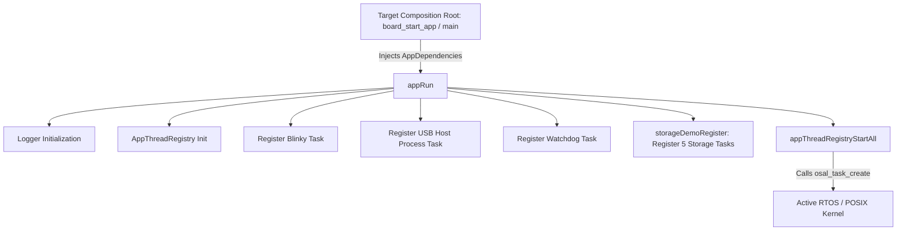
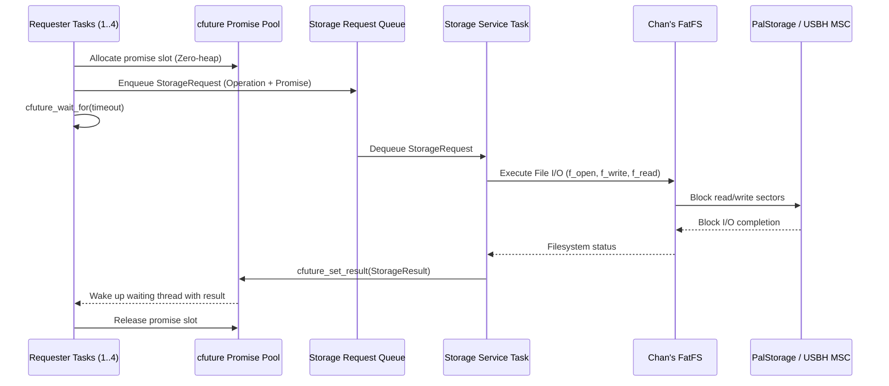
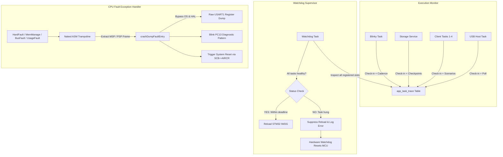

# STM32F407 Multi-RTOS Architecture & Storage Showcase

[](https://www.st.com/en/microcontrollers-microprocessors/stm32f407zg.html)
[]()
[](https://www.freertos.org/)
[](https://github.com/eclipse-threadx/threadx)
[](https://www.zephyrproject.org/)
[]()
[](LICENSE)

An enterprise-grade, OS-agnostic embedded firmware architecture demonstrated on an STM32F407 Cortex-M4 platform. The codebase decouples core business logic, thread management, and hardware peripherals from any specific Real-Time Operating System (RTOS). 

The identical, single-copy application codebase (`app/`) compiles and executes without modification across **four runtime environments**: **FreeRTOS (CMSIS-RTOS2)**, **Azure RTOS ThreadX**, **Zephyr RTOS**, and a **Native POSIX host** (Linux/macOS desktop).

The showcase workload implements an asynchronous, lock-free USB Host Mass Storage (MSC) file service over Chan's FatFS, exercising zero-heap promise/future concurrency, distributed task health supervision, cooperative graceful degradation, and bare-metal CPU exception telemetry.

---

## Table of Contents

- [1. Executive Summary](#1-executive-summary)
- [2. System Architecture](#2-system-architecture)
  - [Architectural Layers](#architectural-layers)
  - [Core Design Principles](#core-design-principles)
- [3. Component Breakdown & Functional Subsystems](#3-component-breakdown--functional-subsystems)
  - [Application Orchestration & Composition Root](#application-orchestration--composition-root)
  - [Storage & Asynchronous Concurrency Subsystem](#storage--asynchronous-concurrency-subsystem)
  - [Observability & Task Health Supervision](#observability--task-health-supervision)
  - [Reliability, Hardware Watchdog & Fault Telemetry](#reliability-hardware-watchdog--fault-telemetry)
- [4. Target Abstraction & Support Matrix](#4-target-abstraction--support-matrix)
  - [Target Platform Comparison Matrix](#target-platform-comparison-matrix)
  - [The Uniform `os_glue/` Architecture](#the-uniform-os_glue-architecture)
  - [Target Bring-Up Flow](#target-bring-up-flow)
- [5. Porting Guide: Adding a New RTOS Target](#5-porting-guide-adding-a-new-rtos-target)
  - [Step 1: Scaffold Target Directory Layout](#step-1-scaffold-target-directory-layout)
  - [Step 2: Implement the Canonical `os_glue` Interfaces](#step-2-implement-the-canonical-os_glue-interfaces)
  - [Step 3: Implement Peripheral & Interrupt Glue](#step-3-implement-peripheral--interrupt-glue)
  - [Step 4: Wire the Target Composition Root](#step-4-wire-the-target-composition-root)
  - [Step 5: Integrate into `build.py`](#step-5-integrate-into-buildpy)
  - [Porting Checklist & Common Gotchas](#porting-checklist--common-gotchas)
- [6. Hardware Specification & Electrical Wiring](#6-hardware-specification--electrical-wiring)
- [7. Repository Layout & File Taxonomy](#7-repository-layout--file-taxonomy)
- [8. Toolchain Setup & Build Guide](#8-toolchain-setup--build-guide)
  - [Prerequisites](#prerequisites)
  - [Unified Build Driver (`build.py`)](#unified-build-driver-buildpy)
  - [Zephyr Freestanding Workspace](#zephyr-freestanding-workspace)
- [9. Diagnostics, Testing & Host Tooling](#9-diagnostics-testing--host-tooling)
  - [Real-Time UART Exception Decoder](#real-time-uart-exception-decoder)
  - [Runtime Task Profiling Telemetry](#runtime-task-profiling-telemetry)
- [10. License](#10-license)

---

## 1. Executive Summary

Most embedded firmware tightly couples application threads, queues, and device drivers to a specific RTOS kernel (e.g., direct calls to `xTaskCreate()`, `tx_thread_create()`, or `k_thread_create()`). This vendor lock-in complicates testing, inflates migration costs, and renders automated desktop CI testing impractical.

This repository demonstrates a clean-architecture pattern designed to address this problem:

1. **Complete OS Isolation**: Application logic interfaces solely with lightweight Platform Abstraction Layers (PAL/OSAL). Switching between FreeRTOS, ThreadX, Zephyr, and Host POSIX requires only linking the corresponding target adapter, leaving application source untouched.
2. **Desktop Simulation & Native CI**: A native POSIX target compiles and executes the identical task logic and storage scenarios on a developer workstation using a simulated RAM disk, allowing instant algorithmic verification without physical hardware.
3. **Zero-Heap Determinism**: The shared application layer employs zero dynamic memory allocation (`malloc`/`free`). All task stacks, control blocks, queues, and promise/future pools are pre-allocated statically at initialization.
4. **Cooperative Liveness & Fail-Safe Supervision**: Rather than refreshing the hardware watchdog blindly on a timer, an independent watchdog task gates hardware refresh on the health check-ins and progress of all registered system threads.
5. **Bare-Metal Fault Telemetry**: Hard faults, bus faults, and memory management violations trigger naked assembly trampolines that capture the exception frame and decode fault registers directly over raw UART registers, bypassing potentially corrupted OS and HAL structures.

---

## 2. System Architecture

### Architectural Layers

The system follows a strict 6-tier layered architecture, enforcing unidirectional dependencies from top to bottom:

```
┌─────────────────────────────────────────────────────────────────────────────┐
│                      LAYER 1: APPLICATION ORCHESTRATION                     │
│    app.c (Composition Consumer)  │  app_threads.c (Central Thread Registry) │
├─────────────────────────────────────────────────────────────────────────────┤
│                      LAYER 2: SERVICES & OBSERVABILITY                      │
│  Storage Service (FatFS Manager) │ Client Scenarios (libcfuture Harness)    │
│  Task Trace & Profiler Engine    │ Crash Dump & Watchdog Supervisor Task    │
│  Logger Subsystem                │ Blinky Heartbeat Task                    │
├─────────────────────────────────────────────────────────────────────────────┤
│                 LAYER 3: PLATFORM & OS ABSTRACTION INTERFACES               │
│  osal.h (Tasks, Queues, Delays)  │ pal_storage.h (Block Storage Interface)  │
│  time_source.h (Monotonic Clock) │ log_sink.h (Character Stream Output)     │
│  led_device.h (Binary Indication)│ cfuture_sync_ops_t (Future Sync Primitives)│
├─────────────────────────────────────────────────────────────────────────────┤
│                 LAYER 4: TARGET ADAPTERS & GLUE (os_glue/)                  │
│              [Uniform 5-file implementation contract per target]            │
│   osal.c  │  board_led.c  │  log_sink_impl.c  │  time_source_impl.c         │
│   cfuture_sync_ops.c      │  usb_host_irq.c   │  board_start_app.c (Root)   │
├─────────────────────────────────────────────────────────────────────────────┤
│                 LAYER 5: VENDOR MIDDLEWARE & RTOS PLATFORMS                 │
│  FreeRTOS Kernel (CMSIS-OS2) │ Azure RTOS ThreadX   │ Zephyr RTOS Kernel    │
│  POSIX Pthreads (Host Target)│ Chan's FatFS R0.15   │ ST USB Host MSC Lib   │
│  STM32F4xx HAL / CMSIS V1.8.5│ GCC Newlib Retarget  │ Zephyr Device Drivers │
├─────────────────────────────────────────────────────────────────────────────┤
│                      LAYER 6: HARDWARE & EXECUTION FABRIC                   │
│  FK407M2-ZGT6 (STM32F407ZGT6, ARM Cortex-M4 @ 168 MHz, 192KB SRAM)         │
│  USB OTG FS Host Controller  │ USART1 Console       │ PC13 User LED │ IWDG  │
│  Host OS Execution Fabric    │ Workstation x86_64   │ In-Memory RAM Disk    │
└─────────────────────────────────────────────────────────────────────────────┘
```

### Core Design Principles

#### 1. Inversion of Control & Composition Root in Pure C
Application logic never discovers or instantiates its own dependencies. Each target implements a thin **Composition Root** (`targets/*/os_glue/board_start_app.c` on embedded targets, `main.c` on Host/Zephyr). 

The composition root instantiates concrete adapters conforming to Layer 3 interfaces, packages them into an immutable `AppDependencies` aggregate, and passes it to `appRun()`:

```c
// app/include/app.h
typedef struct AppDependencies
{
    LedDevice led;
    LogSink logSink;
    TimeSource timeSource;
    PalStorage storage;
    const cfuture_sync_ops_t *cfutureSyncOps;
    OsalTaskEntryFn usbHostProcessEntry;
    void *usbHostProcessContext;
    uint32_t usbHostProcessStackBytes;
    OsalTaskEntryFn watchdogTaskEntry;
    uint32_t watchdogTaskStackBytes;
} AppDependencies;

bool appRun(const AppDependencies *deps);
```

#### 2. Centralized Thread Lifecycle
No task, peripheral module, or driver ever starts its own thread. Modules declare their requirements by registering an `OsalTaskConfig` into a central `AppThreadRegistry` in `app/src/app.c`. Once all subsystems are wired, `appThreadRegistryStartAll()` executes as the **sole invocation point** of `osal_task_create()` in the entire codebase.

#### 3. Strict Interface Segregation
- **Dynamic Adapters**: Interfaces that vary by target instance (`PalStorage`, `LedDevice`, `LogSink`, `TimeSource`) are defined as lightweight C structs containing function pointers and a private `void *context` handle.
- **Static OS Abstractions**: Kernel operations (`osal.h`) are resolved statically via external linkage, as exactly one RTOS or host backend is linked per binary.

---

## 3. Component Breakdown & Functional Subsystems

### Application Orchestration & Composition Root

- **`app/src/app.c`**: Initializes the global `Logger` from injected `LogSink` and `TimeSource` interfaces, instantiates the central thread registry, registers core tasks (Blinky, USB Host pump, Watchdog, and Storage showcase), and starts the scheduler.
- **`app/src/app_threads.c`**: Implements the static thread table, tracking task handles, stacks, and execution entries without dynamic memory allocation.



### Storage & Asynchronous Concurrency Subsystem

The storage subsystem validates safe, multi-threaded filesystem access using asynchronous promise/future primitives.



- **`storage_service.c`**: A high-priority server task that processes requests from an OSAL message queue, mounts FatFS on the underlying `PalStorage` block device, performs buffered file transactions, and fulfills promises.
- **`client_tasks.c`**: Four concurrent client threads validating four distinct concurrency edge cases using `libcfuture` (zero-heap lock-free promise/future library):
  1. **Scenario 1 (Happy Path)**: Sequential write, flush, read-back, and payload CRC verification.
  2. **Scenario 2 (Queue Timeout Cancellation)**: The requester aborts and reclaims resources before the storage service dequeues the operation, confirming the pipeline does not execute stale requests.
  3. **Scenario 3 (Late Completion Discard)**: A slow transaction completes after the requester has timed out; validates that the late result is safely discarded without corrupting shared pools.
  4. **Scenario 4 (ABA Slot Isolation)**: High-speed slot turnover verifying that rapid allocation and destruction do not route results to recycled promise slots.
- **`fatfs_diskio.c`**: Adapts the vendor-neutral Chan FatFS disk I/O interface to the project's `PalStorage` abstraction.
- **`usbh_msc_disk.c`**: Implements `PalStorage` over ST's USB Host Mass Storage Class driver (`USB_OTG_FS`).
- **`pal_host_disk.c`**: Implements `PalStorage` as an in-memory block buffer for native workstation execution.

### Observability & Task Health Supervision

- **`app_task_trace.c`**: High-performance, lock-free task telemetry engine. Tasks self-report execution metrics at deterministic points in their loop:
  - Loop execution start and end timestamps.
  - Iteration turnaround time and cadence.
  - Named progress checkpoints (e.g., `"waiting for queue"`, `"mounting"`, `"servicing request"`).
  - Cooperative shutdown polling (`appTaskTraceShouldStop()`).
- **Graceful Task Teardown**: Tasks support deterministic shutdown without abrupt termination. A stop request triggers clean resource de-allocation (closing FatFS files, unmounting storage, turning off LEDs) before calling `osal_task_exit()`.

### Reliability, Hardware Watchdog & Fault Telemetry

The reliability architecture implements defense-in-depth against software deadlocks, task starvation, and CPU faults:



1. **Distributed Health-Gated Watchdog**:
   - The Independent Watchdog (IWDG) runs on a dedicated internal low-speed oscillator (LSI @ 32 kHz).
   - The `Watchdog` task scans the `AppTaskTrace` registry every second. If *any* registered thread fails to check in within its bounded timeout, the watchdog intentionally **withholds the hardware reload key**, outputs the offending task's name and last recorded checkpoint, and allows the hardware to reset the MCU.
2. **Low-Level CPU Exception Diagnostics (`crash_dump.c`)**:
   - Cortex-M faults (`HardFault`, `MemManage`, `BusFault`, `UsageFault`) execute a naked assembly trampoline in `stm32f4xx_it.c`.
   - The trampoline detects whether the CPU faulted on the Main Stack Pointer (MSP) or Process Stack Pointer (PSP) using `TST LR, #4`, preserving `R0-R3, R12, LR, PC, xPSR`.
   - Handlers completely bypass the active RTOS, HAL, and dynamic buffers, directly accessing raw `USART1` registers to output fault registers, decoded `HFSR`/`CFSR` status flags, and memory fault addresses (`MMFAR`/`BFAR`).
   - A dedicated Python tool (`tools/serial_monitor.py`) watches the UART stream, extracts fault vectors, and performs on-the-fly ELF symbol lookup via `addr2line` and disassembly via `objdump`.

---

## 4. Target Abstraction & Support Matrix

### Target Platform Comparison Matrix

| Architectural Dimension | Native Host (`targets/host`) | FreeRTOS (`targets/freertos`) | Azure ThreadX (`targets/threadx`) | Zephyr RTOS (`targets/zephyr`) |
| :--- | :--- | :--- | :--- | :--- |
| **Execution Domain** | Desktop Linux / macOS | Bare-metal MCU | Bare-metal MCU | Bare-metal MCU |
| **Target Architecture** | x86_64 / ARM64 (POSIX) | ARM Cortex-M4 (STM32F407) | ARM Cortex-M4 (STM32F407) | ARM Cortex-M4 (STM32F407) |
| **Kernel / Scheduler** | `pthread` / POSIX API | FreeRTOS V10 (CMSIS-OS2) | Azure RTOS ThreadX V6 | Zephyr RTOS Kernel |
| **Thread Management** | `pthread_create()` / exit | `osThreadNew()` / exit | `tx_thread_create()` / term | `k_thread_create()` / abort |
| **IPC Queues** | Mutex + Condition Variable | `osMessageQueue*()` | `tx_queue_*()` | `k_msgq_*()` |
| **Block Storage (PAL)**| Heap-backed RAM Disk | USB OTG FS Host MSC | USB OTG FS Host MSC | USB OTG FS Host MSC |
| **Filesystem Engine** | Chan FatFS R0.15 | Chan FatFS R0.15 | Chan FatFS R0.15 | Chan FatFS R0.15 |
| **Timebase Provider** | `clock_gettime(CLOCK_MONO)` | Hardware RTC / SysTick | ThreadX Tick Counter | Zephyr Kernel Uptime |
| **Hardware Watchdog** | *N/A (Host Mock)* | STM32 IWDG (LSI Clock) | STM32 IWDG (LSI Clock) | STM32 IWDG (LSI Clock) |
| **Fault Interception** | POSIX Signals (SIGSEGV) | Naked ASM Trampoline | Naked ASM Trampoline | `k_sys_fatal_error_handler` |
| **Flashing & Debug** | Direct Executable Run | SEGGER J-Link SWD | SEGGER J-Link SWD | SEGGER J-Link SWD |

### The Uniform `os_glue/` Architecture

To prevent architectural drift, every target maintains identical directory layouts and implements the same five canonical filenames:

```
targets/<target_name>/os_glue/
├── include/
│   ├── board_led.h           # Concrete LED driver header
│   ├── cfuture_sync_ops.h    # Promise synchronization header
│   ├── log_sink_impl.h       # Target console sink header
│   └── time_source_impl.h    # Target monotonic clock header
└── src/
    ├── board_led.c           # Concrete implementation (GPIO or stdout)
    ├── cfuture_sync_ops.c    # Target binary semaphore / event flag adapter
    ├── log_sink_impl.c       # Concrete UART / stdout sink driver
    ├── osal.c                # Full OSAL implementation for this target
    └── time_source_impl.c    # Concrete clock implementation
```

Grepping for any adapter filename (e.g., `osal.c` or `board_led.c`) finds all four target implementations at the identical relative path. Target-specific extras (e.g., `rtc_time_source.c` on FreeRTOS, `osal_byte_pool.h` on ThreadX, or `hal_shim.c` on Zephyr) exist alongside the standard five without disguising their purpose.

### Target Bring-Up Flow

```
[Hardware Reset]
       │
       ▼
[Board / System Bring-Up]
  - FreeRTOS:  main() -> HAL_Init() -> SystemClock_Config() -> MX_FREERTOS_Init()
  - ThreadX:   main() -> HAL_Init() -> SystemClock_Config() -> App_ThreadX_Init()
  - Zephyr:    POST_KERNEL device init -> main()
  - Host:      main()
       │
       ▼
[Composition Root: board_start_app() / main()]
  1. crashDumpEarlyInit()        (Configure exception vectors & arm IWDG)
  2. board_led_init()            (Initialize LED GPIO adapter)
  3. log_sink_init()             (Initialize UART / stdout adapter)
  4. time_source_init()          (Initialize RTC or tick timer adapter)
  5. usbhMscDiskInit()           (Initialize USB MSC block storage adapter)
  6. Populate AppDependencies struct
       │
       ▼
[appRun(&deps)] (app/src/app.c)
  1. Initialize Logger
  2. Register Blinky, USB Host, Watchdog, Storage tasks into AppThreadRegistry
  3. appThreadRegistryStartAll() -> calls osal_task_create()
       │
       ▼
[Active RTOS Scheduler Starts Multi-Threaded Execution]
```

---

## 5. Porting Guide: Adding a New RTOS Target

Porting this architecture to a new RTOS (e.g., **RT-Thread**, **SEGGER embOS**, **Apache NuttX**, or a proprietary in-house kernel) requires **zero modifications** to `app/`. The porting process follows a structured 5-step checklist.

### Step 1: Scaffold Target Directory Layout

Create a new directory `targets/<new_rtos>/` mirroring the uniform repository structure:

```text
targets/<new_rtos>/
├── os_glue/
│   ├── include/
│   │   ├── board_led.h          # LED device init
│   │   ├── cfuture_sync_ops.h   # Synchronization operations header
│   │   ├── log_sink_impl.h      # Log sink init
│   │   └── time_source_impl.h   # Time source init
│   └── src/
│       ├── board_led.c          # Concrete LED driver
│       ├── cfuture_sync_ops.c   # Binary semaphore adapter for libcfuture
│       ├── log_sink_impl.c      # Concrete UART character stream driver
│       ├── osal.c               # Full OSAL implementation
│       ├── time_source_impl.c   # Monotonic clock driver
│       ├── usb_host_irq.c       # USB OTG FS IRQ routing (if on STM32)
│       └── board_start_app.c   # Composition root
├── Makefile                     # Or CMakeLists.txt
└── Core/, Middlewares/          # Kernel source and startup code
```

### Step 2: Implement the Canonical `os_glue` Interfaces

Implement the five standard contracts in `targets/<new_rtos>/os_glue/src/`:

1. **`osal.c` (`app/include/osal.h`)**:
   - **Task Management**:
     - `osal_task_create(const OsalTaskConfig *config, OsalTaskHandle *outHandle)`: Translate `OsalTaskConfig` (name, entry, context, stack size in bytes, priority) into native kernel thread creation.
     - `osal_task_exit(void)`: Terminate the calling thread cleanly (must never return).
   - **Message Queues**:
     - `osal_queue_create(uint32_t itemCount, size_t itemSize, OsalQueueHandle *outHandle)`
     - `osal_queue_send(OsalQueueHandle handle, const void *item, uint32_t timeoutMs)`
     - `osal_queue_receive(OsalQueueHandle handle, void *outItem, uint32_t timeoutMs)`
   - **Mutual Exclusion & Timing**:
     - `osal_mutex_create()`, `osal_mutex_lock(handle, timeoutMs)`, `osal_mutex_unlock()`
     - `osal_delay_ms(uint32_t milliseconds)`
     - `osal_get_time_ms(void)`: Return monotonic milliseconds elapsed since system boot.
   - **Heap Memory (for USB Host Library)**:
     - `osal_malloc(size_t size)`, `osal_free(void *ptr)`: Route to the RTOS byte pool or standard library heap.

2. **`cfuture_sync_ops.c` (`external/cfuture/`)**:
   - Implement the `cfuture_sync_ops_t` table linking `libcfuture`'s promise synchronization to the RTOS's native binary semaphore or event flag:
     ```c
     static bool sem_create(cfuture_sem_t *sem);
     static void sem_destroy(cfuture_sem_t *sem);
     static bool sem_wait(cfuture_sem_t *sem, uint32_t timeout_ms);
     static void sem_post(cfuture_sem_t *sem);

     const cfuture_sync_ops_t *cfuture_sync_ops_get(void);
     ```

3. **`board_led.c` (`app/include/led_device.h`)**:
   - Implement `board_led_init(LedDevice *outDev)` binding `on`, `off`, and `toggle` function pointers to hardware GPIO controls.

4. **`log_sink_impl.c` (`app/include/log_sink.h`)**:
   - Implement `log_sink_init(LogSink *outSink)` binding the `write(const char *str, void *context)` function pointer to your platform UART or logging peripheral.

5. **`time_source_impl.c` (`app/include/time_source.h`)**:
   - Implement `time_source_init(TimeSource *outSource)` providing a monotonic millisecond time provider (`nowMs`).

### Step 3: Implement Peripheral & Interrupt Glue

- **USB Host Interrupt Handler (`usb_host_irq.c`)**:
  Provide `usbHostIrqInit(void)` and `usbHostIrqDisable(void)`. Connect the MCU's `OTG_FS_IRQHandler` to the target's interrupt registration mechanism (e.g., `HAL_NVIC_SetPriority` + `HAL_NVIC_EnableIRQ`, or native RTOS IRQ dispatcher).
- **CPU Exception Traps**:
  If targeting Cortex-M hardware, forward `HardFault_Handler`, `MemManage_Handler`, `BusFault_Handler`, and `UsageFault_Handler` via naked assembly trampolines to `crashDumpFaultEntry(stackFrame)`.

### Step 4: Wire the Target Composition Root

Create `board_start_app.c` (or adapt `main.c`) to initialize the hardware, configure dependencies, and pass them to `appRun()`:

```c
#include "app.h"
#include "board_led.h"
#include "cfuture_sync_ops.h"
#include "crash_dump.h"
#include "log_sink_impl.h"
#include "time_source_impl.h"
#include "usbh_msc_disk.h"
#include "usb_host.h"

static PalStorage s_storage;

void board_start_app(void)
{
    // 1. Arm independent hardware watchdog and fault vectors
    crashDumpEarlyInit();

    // 2. Build concrete dependency adapters
    AppDependencies deps = {0};
    board_led_init(&deps.led);
    log_sink_init(&deps.logSink);
    time_source_init(&deps.timeSource);
    usbhMscDiskInit(&s_storage);
    deps.storage = s_storage;
    deps.cfutureSyncOps = cfuture_sync_ops_get();

    // 3. Register background support tasks
    deps.usbHostProcessEntry = usbHostProcessTaskEntry;
    deps.usbHostProcessStackBytes = 4096U;
    deps.watchdogTaskEntry = crashDumpWatchdogTaskEntry;
    deps.watchdogTaskStackBytes = 2048U;

    // 4. Start the application orchestration
    appRun(&deps);
}
```

### Step 5: Integrate into `build.py`

Update `build.py` to recognize the new target:
1. Add `<new_rtos>` to the `--target` CLI choices.
2. Define `BUILD_DIR`, `ELF_PATH`, and `BIN_PATH` constants.
3. Wire the compile command (`make` or `cmake --build`) into the dispatch dictionary.

### Porting Checklist & Common Gotchas

- **Stack Size Units**: `OsalTaskConfig.stackSizeBytes` is always specified in **bytes**. If your RTOS kernel expects stack depth in 32-bit words (such as native FreeRTOS `xTaskCreate`), ensure your `osal.c` divides by `sizeof(uint32_t)` to avoid allocating 4x larger stacks than requested.
- **Bounded Synchronization**: Ensure `osal_queue_receive()` and `osal_mutex_lock()` correctly handle timeouts. Infinite blocking (`timeoutMs = 0xFFFFFFFF`) must not be used on loops monitored by `app_task_trace`, or the task will appear stalled and the watchdog supervisor will trigger a system reset.
- **Pre-Scheduler Peripherals**: `usbhMscDiskInit()` configures USB Host structures; ensure hardware clocks and GPIO pins are initialized before calling it.
- **Cooperative Exit Semantics**: `osal_task_exit()` must terminate the calling thread cleanly. In RTOSes where a thread cannot delete itself directly (such as ThreadX), invoke the appropriate terminate primitive (`tx_thread_terminate()`).

---

## 6. Hardware Specification & Electrical Wiring

Testing and validation are performed on the **FK407M2-ZGT6** development board featuring the **STM32F407ZGT6** microcontroller.

### Board Specifications
- **MCU**: STM32F407ZGT6 (144-pin LQFP)
- **Core**: ARM 32-bit Cortex-M4 with FPU @ 168 MHz (210 DMIPS)
- **Memory**: 1024 KB Flash, 192 KB SRAM (128 KB Main SRAM + 64 KB CCM SRAM)
- **Clock Sources**: 8.0 MHz High-Speed External (HSE) crystal, 32.768 kHz Low-Speed External (LSE) crystal

### Pin Mapping & Peripherals
| Peripheral | MCU Pin | Function / Net | Electrical Characteristics |
| :--- | :--- | :--- | :--- |
| **USART1 Console** | `PA9` | USART1_TX | 115200 Baud, 8N1, Push-Pull, Connected to USB-UART |
| **USART1 Console** | `PA10`| USART1_RX | 115200 Baud, 8N1, Input Floating |
| **User Status LED**| `PC13`| LED1 | Active LOW (Low = On, High = Off) |
| **USB OTG FS Host**| `PA11`| USB_OTG_FS_DM | Full-Speed 12 Mbps Differential Data- |
| **USB OTG FS Host**| `PA12`| USB_OTG_FS_DP | Full-Speed 12 Mbps Differential Data+ |
| **USB OTG VBUS**   | `PA9` / VBUS | 5V Bus Power | Powered via onboard Type-C port + OTG A-to-C adapter |
| **SWD Debug Port** | `PA13`| SWDIO | Debug Data Line (SEGGER J-Link) |
| **SWD Debug Port** | `PA14`| SWCLK | Debug Clock Line (SEGGER J-Link) |
| **Hardware Reset** | `NRST`| RESET | Target Reset Line |

> [!NOTE]
> The FK407M2-ZGT6 board has no on-board ST-LINK probe. Flashing and hardware debugging require an external probe (e.g., SEGGER J-Link) wired to the standard 2.54mm SWD header.

---

## 7. Repository Layout & File Taxonomy

```
stm32f407-threadx/
├── app/                               # Shared, OS-agnostic application core (Single Copy)
│   ├── include/
│   │   ├── app.h                      # AppDependencies aggregate & appRun() declaration
│   │   ├── app_task_trace.h           # Lock-free task telemetry and supervision interfaces
│   │   ├── app_threads.h              # Central AppThreadRegistry table interface
│   │   ├── blinky_task.h              # Diagnostic heartbeat task
│   │   ├── client_tasks.h             # The 4 libcfuture concurrency test scenarios
│   │   ├── crash_dump.h               # Bare-metal CPU exception handler & IWDG watchdog
│   │   ├── fatfs_diskio.h             # Chan FatFS disk I/O driver binding
│   │   ├── fatfs_time.h               # FAT timestamp provider interface
│   │   ├── led_device.h               # Abstract LED control interface
│   │   ├── log_level.h / log_sink.h   # Logging severity and sink abstraction
│   │   ├── logger.h                   # Structured logger engine
│   │   ├── osal.h                     # Operating System Abstraction Layer interface
│   │   ├── pal_storage.h              # Platform Block Storage abstraction interface
│   │   ├── storage_demo.h             # Storage subsystem registration entry
│   │   ├── storage_protocol.h         # Storage request/result message payload types
│   │   ├── storage_service.h          # Storage service worker task
│   │   ├── time_source.h              # Monotonic timebase interface
│   │   ├── usb_host.h                 # USB Host process entry and peripheral handles
│   │   ├── usbh_conf.h                # USB Host low-level configuration interface
│   │   └── usbh_msc_disk.h            # PalStorage adapter backed by USB Host MSC
│   └── src/
│       ├── app.c                      # Composition orchestrator: registers & starts all tasks
│       ├── app_task_trace.c           # Turnaround, cadence, and checkpoint tracking engine
│       ├── app_threads.c              # Sole invocation point for osal_task_create()
│       ├── blinky_task.c              # Heartbeat implementation
│       ├── client_tasks.c             # Concurrency test scenario implementations
│       ├── crash_dump.c               # Naked register capture, raw UART dump, IWDG task
│       ├── fatfs_diskio.c             # FatFS to PalStorage bridge
│       ├── fatfs_time.c               # FAT file timestamp binding
│       ├── logger.c                   # Timestamped string formatting engine
│       ├── storage_demo.c             # Queue allocation, promise pool init, task registration
│       ├── storage_service.c          # Worker task executing filesystem transactions
│       ├── usb_host.c                 # USB Host background processing state machine
│       ├── usbh_conf.c                # ST USB Host low-level driver glue
│       └── usbh_msc_disk.c            # PalStorage block driver over USB Host MSC
├── external/                          # Vendored third-party code (Plain vendored, no submodules)
│   ├── cfuture/                       # libcfuture: Zero-heap lock-free promise/future library
│   ├── fatfs/                         # Chan's FatFS R0.15 filesystem library
│   ├── gcc_newlib_stubs/              # Reentrant syscalls.c and sysmem.c stubs
│   ├── stm32f4xx_hal/                 # ST Microelectronics CMSIS & STM32F4xx HAL V1.8.5
│   └── usb_host_lib/                  # ST USB Host Core + Mass Storage Class (MSC) library
├── targets/                           # Platform-specific targets and concrete adapters
│   ├── host/                          # Native POSIX / Workstation target
│   │   ├── main.c                     # Host composition root
│   │   ├── pal_host_disk.c/.h         # In-memory RAM disk block driver
│   │   └── os_glue/                   # Host implementations of the 5 canonical adapters
│   ├── freertos/                      # FreeRTOS V10 (CMSIS-RTOS2) STM32 target
│   │   ├── Core/                      # CubeMX startup, clock config, interrupt vectors
│   │   ├── Middlewares/               # FreeRTOS kernel source and CMSIS-OS2 layer
│   │   ├── Makefile.freertos          # GNU Make build definition
│   │   └── os_glue/                   # FreeRTOS implementations of the 5 canonical adapters
│   ├── threadx/                       # Azure RTOS ThreadX STM32 target
│   │   ├── AZURE_RTOS/                # ThreadX kernel source and architecture ports
│   │   ├── Core/                      # CubeMX startup, clock config, interrupt vectors
│   │   ├── Makefile                   # GNU Make build definition
│   │   └── os_glue/                   # ThreadX implementations of the 5 canonical adapters
│   └── zephyr/                        # Zephyr RTOS T2 freestanding application
│       ├── boards/                    # Devicetree overlay for FK407M2 pinout retargeting
│       ├── prj.conf                   # Zephyr Kconfig configuration
│       ├── src/main.c                 # Zephyr composition root
│       └── os_glue/                   # Zephyr implementations of the 5 canonical adapters
├── tools/                             # Developer CLI and diagnostic host tools
│   ├── _toolchain.py                  # Automatic ARM GCC and host toolchain discovery
│   └── serial_monitor.py              # Real-time UART monitor with live addr2line fault decoding
├── build.py                           # Unified multi-target orchestrator CLI
└── CMakeLists.txt                     # CMake build definition for native Host target
```

---

## 8. Toolchain Setup & Build Guide

### Prerequisites

#### 1. Embedded ARM Toolchain
- **ARM GNU Toolchain**: `arm-none-eabi-gcc` (tested with GCC 10.3 / 12.3 / 13.2).
- The build orchestrator auto-discovers `arm-none-eabi-gcc` from your system `PATH`, or automatically detects STM32CubeIDE toolchain bundles.
- You may explicitly specify toolchain paths via the `GCC_PATH` environment variable:
  ```bash
  export GCC_PATH=/opt/arm-gnu-toolchain/bin
  ```

#### 2. Host Build Tools
- **CMake**: Version >= 3.22 (Host build), Version >= 3.28 (Zephyr build).
- **Python**: Python 3.10+ with `pyserial` installed (`pip install pyserial`).
- **Make**: GNU Make >= 4.1.
- **Flashing Probe**: SEGGER J-Link software suite (`JLinkExe`).

---

### Unified Build Driver (`build.py`)

A single Python CLI manages building, flashing, cleaning, and inspecting all targets.

```bash
# ---------------------------------------------------------------------------
# 1. Native Desktop Target (POSIX)
# ---------------------------------------------------------------------------
# Compiles natively with host GCC/Clang and runs storage showcase on RAM disk:
python3 build.py --target host --build
python3 build.py --target host --run

# ---------------------------------------------------------------------------
# 2. FreeRTOS Target (ARM Cross-Compilation)
# ---------------------------------------------------------------------------
python3 build.py --target freertos --build
python3 build.py --target freertos --flash      # Program board via J-Link SWD

# ---------------------------------------------------------------------------
# 3. Azure RTOS ThreadX Target (ARM Cross-Compilation)
# ---------------------------------------------------------------------------
python3 build.py --target threadx --build
python3 build.py --target threadx --flash       # Program board via J-Link SWD

# ---------------------------------------------------------------------------
# 4. Zephyr RTOS Target (Freestanding West Build)
# ---------------------------------------------------------------------------
python3 build.py --target zephyr --build
python3 build.py --target zephyr --flash        # Program board via J-Link SWD

# ---------------------------------------------------------------------------
# 5. Multi-Target Batch Operations
# ---------------------------------------------------------------------------
python3 build.py --all                          # Compile all 4 targets sequentially
python3 build.py --stats                        # Print Flash/SRAM memory breakdown
python3 build.py --clean                        # Purge all build artifacts
```

### Zephyr Freestanding Workspace

The Zephyr target is structured as a **Zephyr T2 Freestanding Application**. The repository contains only application code and devicetree overlays; it references an external Zephyr west workspace (`~9GB`) containing the Zephyr kernel and HAL modules.

By default, `build.py` points to a sibling workspace at `~/sandbox/embedded/stm32f407-zephyr`. To point to a custom workspace, export the `ZEPHYR_WORKSPACE` environment variable:

```bash
export ZEPHYR_WORKSPACE=/path/to/my-zephyr-workspace
python3 build.py --target zephyr --build
```

---

## 9. Diagnostics, Testing & Host Tooling

### Real-Time UART Exception Decoder

The project includes an automated fault diagnostic monitor inspired by ESP-IDF's panic handler: [`tools/serial_monitor.py`](file:///home/mrumoy/sandbox/embedded/stm32f407-threadx/tools/serial_monitor.py).

When an embedded target encounters an exception, the MCU dumps the raw Cortex-M stack frame over USART1. The monitor captures the dump, matches the target's ELF binary, invokes `arm-none-eabi-addr2line` to map hex addresses to source files and line numbers, and executes `arm-none-eabi-objdump` to display annotated assembly instructions surrounding the crash site:

```bash
# Attach monitor to active board UART:
python3 tools/serial_monitor.py --target freertos
```

#### Captured Crash Telemetry Example
```
========================================
          HARD FAULT DETECTED
========================================

Fault PC  = 0x08003638
Fault LR  = 0x08002FED

--- Register Dump ---
R0  = 0x0501BD00   R1  = 0x00000770   R2  = 0x000F423F   R3  = 0x00000040
R12 = 0x0000000A   LR  = 0x08002FED   PC  = 0x08003638   PSR = 0x01000000
SP  = 0x2001FF08

--- Fault Status ---
HFSR  = 0x40000000 -> FORCED: Escalated fault
CFSR  = 0x00010000
UsageFault:
  -> Undefined instruction
========================================

>>> Decoded Symbol Information:
--- Fault PC: crashDumpTriggerTestFault() ---
app/src/crash_dump.c:425
Source:
   424:        case 2:
   425:            crashDumpRawUartPuts("Triggering undefined instruction...\r\n");
   426:            __asm volatile(".word 0xFFFFFFFF");
   427:            break;
Disassembly:
 8003634:   bl    8003028 <crashDumpRawUartPuts>
 8003638:   .word 0xffffffff  <-- FAULT TRIGGER
```

---

### Runtime Task Profiling Telemetry

When connected to USART1 @ 115200 Baud, the system streams diagnostic logs showing task cadence, turnaround latency, and scenario validation results:

```text
[up 00:00:01] [EVENT] System start
[up 00:00:02] [EVENT] USB Host MSC Device Connected (LUNs: 1)
[up 00:00:02] [EVENT] FatFS Volume Mounted Successfully
[up 00:00:03] [EVENT] scenario1 PASS: write/read roundtrip verified
[up 00:00:03] [EVENT] scenario2 PASS: write timed out before T_S dequeued it, block unchanged
[up 00:00:03] [EVENT] scenario3 PASS: late completion safely discarded
[up 00:00:04] [EVENT] scenario4 PASS: second requester got an isolated slot
[up 00:00:10] [EVENT] trace: Blinky        iter=9    turnaround=1000ms cadence=1000ms up=0ms
[up 00:00:10] [EVENT] trace: UsbHostPump   iter=996  turnaround=0ms    cadence=10ms   up=0ms
[up 00:00:10] [EVENT] trace: Watchdog      iter=10   turnaround=0ms    cadence=1000ms up=0ms
[up 00:00:10] [EVENT] trace: StorageSvc    iter=38   turnaround=50ms   cadence=50ms   up=0ms
[up 00:00:10] [EVENT] trace: StorageHappy  iter=4    turnaround=10ms   cadence=3010ms up=0ms
```

If any task stalls or exceeds its deadline, the watchdog suppresses the hardware refresh and emits a fault alert before the hardware watchdog triggers:

```text
[up 00:00:29] [ERROR] watchdog: StorageSvc UNHEALTHY - 25625 ms since check-in, last checkpoint 'servicing request'
```

---

## 10. License

This project is licensed under the MIT License - see the [LICENSE](LICENSE) file for details.
Third-party vendor libraries located in `external/` (Chan FatFS, ST HAL/USB, libcfuture) are governed by their respective licenses.
